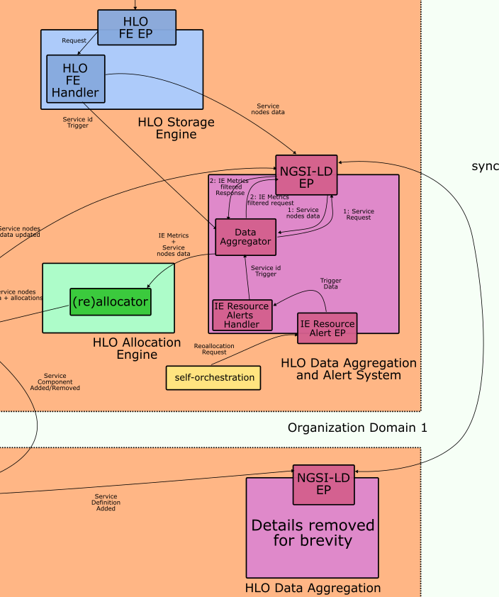

# HLO Data Aggregator

Component of the HLO responsible for interacting with aeriOS domain data fabric to retrieve all data needed for defining the most suitable IE accros the continuum for each workload to be  executed. 

## Description
Triggered by HLO frontend component, exposing and handling HLO Endpoint's, through message broker in protobuf format, including newly arrived service request id.
Retrieves all service runtime and computing resources requirments and  queries data fabric for all IEs which capable to support requirements.
Merges service requirements data and candidate IEs data in a protobuf message and forwards message to HLO Allocator by pushing the message to domain broker. 
The same process can also be initiated internally from self-orchestration component whcih might request service migration.

## Badges


## Visuals
Data-aggregator interaction with HLO frontend (purple coponent) and allocator (in green).
Also events for service migration initiated by self-orchestration are present.




Related data model schemas:
<table>
<tr>
<th> Messages exchanged </th>
<th> Primitives definition </th>
</tr>
<tr>
<td valign="top">

```
syntax = "proto3";

import "hlo.proto";

message HLOFEInput {
    Service service = 1;
}

message ServiceComponentRequirement {
    ServiceComponent service_component_definition = 2;
    repeated InfrastructureElement infrastructure_element_candidates = 1;
}

message HLOAllocatorOutput {
    repeated ServiceComponentRequirement service_component_requirements  = 1;
}
```

</td>
<td>

```
syntax = "proto3";

message Domain {
    string id = 1;
}

message Service {
    string id = 1;
}

message LowLevelOrchestrator {
    string id = 1;
    string orchestration_type = 3;
    Domain domain = 2;
}

message InfrastructureElement {
    string id = 1;
    float total_ram = 2;
    float cpu_cores = 3;
    float avg_power_consumption = 4;
    bool real_time_capable = 5;
    float current_ram = 6;
    float current_cpu_usage = 7;
    float current_power_consumption = 8;
    Domain domain = 9;
    LowLevelOrchestrator low_level_orchestrator = 10;
}

message Port {
    int32 number = 1;
}    

message ServiceComponent {
    string id = 1;
    string image = 2;
    repeated Port ports = 3;
    Service service = 4;
    ServiceComponentConstraints service_component_constraints = 5;
    optional InfrastructureElement infrastructure_element = 6;
}

message ServiceComponentConstraints {
    map<string, float> constraints = 1;
}
```
</td>
</tr>
</table>


## Add your files

- [ ] [Create](https://docs.gitlab.com/ee/user/project/repository/web_editor.html#create-a-file) or [upload](https://docs.gitlab.com/ee/user/project/repository/web_editor.html#upload-a-file) files
- [ ] [Add files using the command line](https://docs.gitlab.com/ee/gitlab-basics/add-file.html#add-a-file-using-the-command-line) or push an existing Git repository with the following command:

```
cd existing_repo
git remote add origin https://gitlab.aeros-project.eu/wp3/t3.3/hlo-data-aggregator.git
git branch -M main
git push -uf origin main
```

## Installation
Easier when using Makefile. Edit variables, if needed, and :
* Build and tag docker image
```
 make build
```
* Push to aeriOS repository
```
 make push
```
* Package and upload helm chart
```
 make helm-upload
```
* Deploy against cluster chosen as current k8s context
```
 make deploy
```
* All the above
```
 make all
```
* Removes docker image
```
 make clean-build
```
* Removes the helm deployment from the cluster
```
 make clean-deploy 
```
* Removes all the above
```
 make clean-all 
```

## Usage
After pulling, activate virtual env, install requirements and cd to src. Then: 
`$ python3 main.py`
To use MVP redpanda deployment:
`$ kubectl port-forward -n redpanda svc/redpanda 9093:9093`


## Support
Please use Mattermost T3.3 channel

## Roadmap
Proceed with Orion-CB queries and compile complte message for Allocator.


## Authors and acknowledgment
aeriOS team

## License
Copyright 2023.

Licensed under the Apache License, Version 2.0 (the "License"); you may not use this file except in compliance with the License. You may obtain a copy of the License at

    http://www.apache.org/licenses/LICENSE-2.0

Unless required by applicable law or agreed to in writing, software distributed under the License is distributed on an "AS IS" BASIS, WITHOUT WARRANTIES OR CONDITIONS OF ANY KIND, either express or implied. See the License for the specific language governing permissions and limitations under the License.


## Project status
In development. Supported. Ongoing

***
